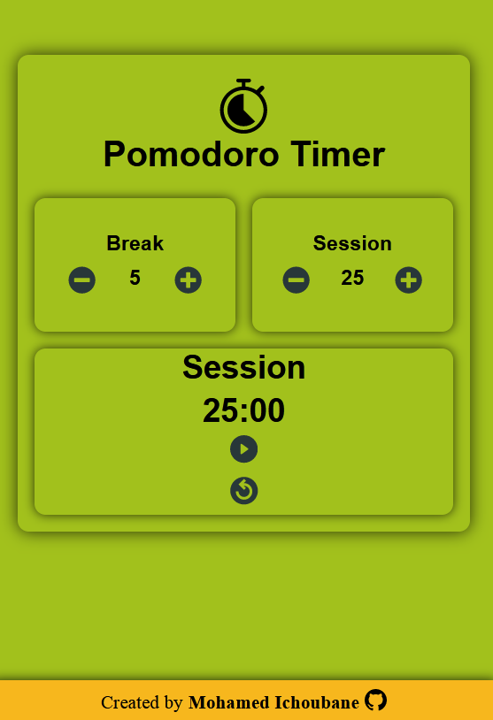

# Pomodoro Timer

The Pomodoro Technique is a time management method based on 25-minute stretches of focused work broken
by five-minutes breaks. Longer breaks, typically 15 to 30 minutes, are taken after four consecutive work
intervals. Each work interval is called a pomodoro,

[Live Demo](https://IchoubaneMed.github.io/pomodoro_timer)

## Getting started

    git clone https://github.com/IchoubaneMed/pomodoro_timer.git
    cd pomodoro_timer
    npm install
    npm start

## built with 

- React
- React Icons